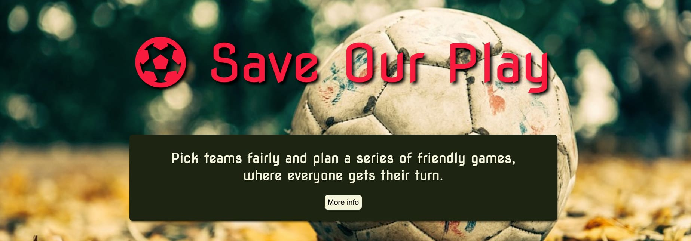
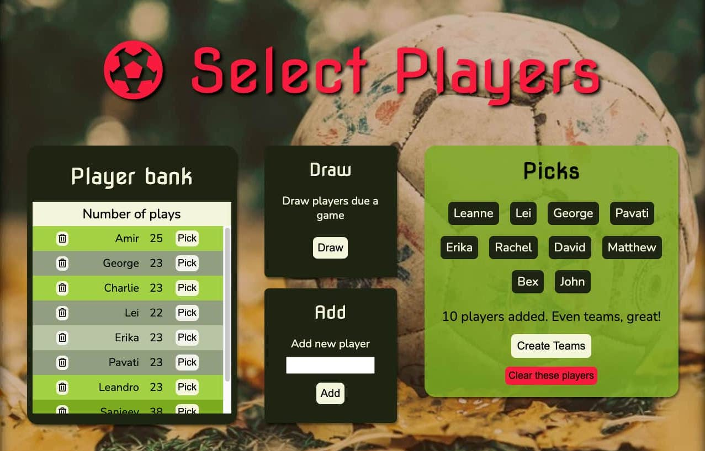
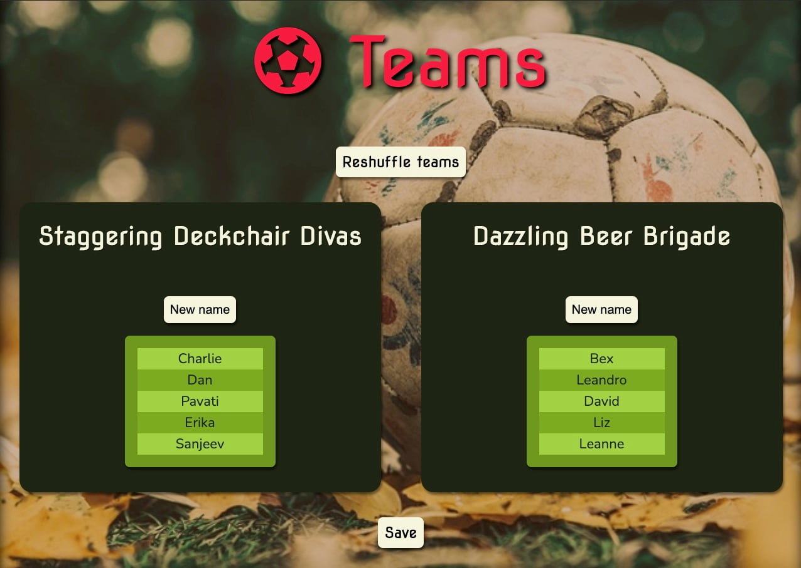
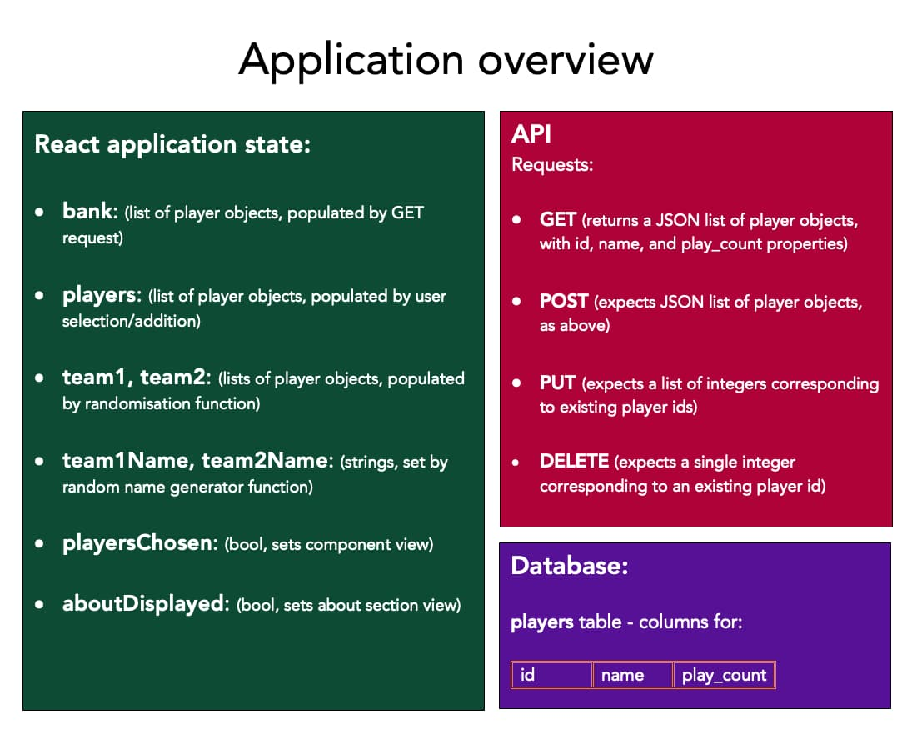

# Save Our Play 

Save our Play is a React-Redux web application built in accordance with a [brief](https://3.basecamp.com/4525821/buckets/18134884/documents/2886516324) to create a tool which randomly picks football teams, for the individual technical challenge set at the end of the DevelopMe Fellowship. This is the repository for the user interface. Save our Play is powered by [an API](https://github.com/ammersive/tp-back) built in Laravel which stores play information between browser sessions. The app is available [here](https://ammersive.github.io/save-our-play/).

## Pick teams fairly and plan a series of friendly games, where everyone gets their turn.

### Save Our Play is a web application for groups who play a regular series of games, considering:

- Not everyone is always available to play in each game.
- More people may want to play than the team size - particularly with current COVID restrictions on the numbers in which teams can safely meet and practice.

## Features

### Player bank 

To help adjudicate who’s due the next game when there are more people who want to play than spaces available, the player bank keeps track of the games assigned to each player on save. You can pick available players directly from the bank when you plan games. New players added in the Select Players screen will appear in the bank after pressing the Create Teams button and then pressing Save in the Teams screen.

### Draw by play-count

The Draw feature automatically picks players from the bank with the lowest play-counts. If multiple players share the lowest count, the selection is randomised within this set. 

### n-a-side support

Any team size is supported, respecting variation in restrictions. A warning displays when teams will have an uneven number of players.

### Randomise Teams

Once happy with player selection, sort players into teams randomly with Create Teams, moving to the Teams screen. Once on the Teams screen, you can randomise the arrangements again with Reshuffle teams.

### Team name generator

Don’t take play too seriously? The Generate team namefeature will give you a (near) endless supply of tongue-in-cheek triple-barrel names for each side.

###  Version 2 information:

Save our Play stores player data between sessions, powered by [this API](https://github.com/ammersive/tp-back). Version 1, which returns to a default state between browser sessions, can be found [here](https://ammersive.github.io/team-picker/), and its repository [here](https://github.com/ammersive/team-picker).

# Project process and retrospective

This is the first React-Redux app I have built entirely independently. I wanted to minimise risk, whilst also implementing a work-flow that would enable me to build more complex functionality if time allowed, and so I chose to follow agile project management techniques. In the following, I give an overview of the project process, a retrospective, and next steps. In the section after this, I give a more in-depth overview of how the application works, for those interested in the details.

### Agile

Following agile meant getting an MVP up and running first, without a back-end and an API. I aimed to first fulfil the minimum requirements of the brief, without styling, by building something that allowed the user to add names through an input, and have them randomly pushed into two lists. Once that was working, I added stretch goal features: the random name generator, the player bank, and the draw by play-count feature. Once all of the logic was working, I styled the components. That front-end only Version 1 application is deployed [here](https://ammersive.github.io/team-picker/). 

### Batch updates with an API

When it came to the API, I felt I was doing something reasonably ambitious by handling lists of player objects as opposed to running operations on individual objects, and it was going to take some independent research that went beyond what I had previously learned to work out (i) how to write a controller in Laravel that would loop over a list of records in a single API request, and (ii) how pass it lists of players from the user interface. 

Happily, the Version 1 build happened with sufficient time remaining to look into the API, and after researching how other people have written Laravel controller methods which do batch updates on a database, I went ahead and built my API in Laravel, testing all my routes with Postman, and deployed with AWS. 

### Updating the front-end data model

One issue now was that players on the front end comprised only name and play-count properties, but the MySQL database required that player entries have ids as their primary key. This meant I had to update the data handling on the front end so that players were passed around the application with an id property. Newly created players could only be assigned a numeric id once they had been submitted in a POST request to the database. How to handle them in React prior to the POST request? I chose for my AddPlayers component to create new players with an id property, but set it to null. This is how the updatePlayCounts function (see below, or see reducer.js) tells new players apart from those that already exist in the database, as the former need to be handled with a POST request, the latter with a PUT request.  

### Testing and fixing bugs

I put an emphasis on testing at every stage throughout the project. I logged a lot of information to the console as I wrote both actions and reducer functions. On the back end, I made a good deal of use of artisan tinker to work out the iterative controller methods. I made an effort to test frequently, and to think about edge cases (for instance, a message which deals with “players” (plural) will have different grammar to one that deals with just one player). I would also make components log information to the console, both from inside the component itself, as well as the index.js wrapper, to verify what they knew about the application state, and what data they were passing around. When my action creators and reducer functions failed, it was often because they were receiving “undefined” data, and this was invariably because I had not passed the right data as props to the relevant components. I found that sketching out the journey the data took through the components, action creators, API, and reducers, helped me to visualise the architecture and what I needed to do to get things working.  

I also tried to think of edge cases in the user journey whilst I was testing how a user would step through the application, which revealed a series of bugs. One particularly mysterious one arose with the player bank buttons (actually, a single button, nested inside the bank component which is then rendered as many times as there are players in the bank). Once you had gone through player selection, saved players to the bank, and started to go around again, it appeared that these buttons were one move behind the rest of the application state. It was as if the button no-longer knew what player it was on. After some head scratching and a good Google, I realised I was not making proper use of props, and instead was trying to pass the player information through the button component’s own local state, which wasn’t receiving current information from the store. Pulling player information directly from the passed in props and not passing it unnecessarily through the component’s local state fixed things nicely, and gave me a good reminder about what needs to go through local state first, and what can just be passed directly in and out. 

Another bug appeared if you selected a player so they moved into the picked players list, and then deleted them from the Bank component. The bug arose because the database would later receive a PUT request carrying an id that no longer existed. I fixed this by ensuring the deletePlayer reducer checks to see if the player is in the picked list, and removes them from there if so. 

## Retrospective

If I were to do the project again, I’d be confident I could build something with this level of functionality full-stack from the start. 

It was a good learning experience to get the logic working for both a front-end only application just with Javascript, as well as with an API using PHP, but as I mentioned above, it did mean I had to update the data model on the front end, by adding an extra id property to player objects. In my very earliest MVP, players didn’t have play-counts either, they were simply strings being passed between a few React components.

I think I did the right thing to start off cautiously with a very modest proposal, but I do acknowledge how having to change my front-end data model twice meant there was extra work to do. But in having to do this, I think I’ve gained a better understanding of React-Redux, as well as of Laravel, and feel confident that I can make foundational changes to an entire application’s functionality, rather than only being able to add incremental changes. There is of course still a lot more to learn, but I’m already planning my next full-stack project. Watch this (or rather, that of the adjacent repo’s…) space!

## Next steps

If I were to add further functionality to the application, I think it could be really nice to be able to keep track of player availability. This would be quite a large change to the application, but I think it’s doable: it would involve updating the back-end to store dates, probably by creating a new table that has a many-to-many relationship with players. The UI would need a big redesign too: the player bank would want to be quite a bit wider, so it could display a table of player availability. We’d probably also want a way to input availability by clicking/tapping a calendar of days which are by default set to available, and which change to unavailable on click, rather than having to select each day from a date picker tool for each player, which could become arduous. What would be really nice about this extra functionality is that the Draw feature could be updated so that it draws not only by play-count, but by player availability too. 

Another update could be to track game data. I interpreted the brief by reasoning that if the main functionality requested is that players are randomly pushed into teams for each game, then perhaps game/score information isn’t as important to the user as the handling of individual player information, which is why I didn’t add any features that handle scores/games. But I could build this in: it would mean setting up another table on the back end which has a many-to-many relationship with the players table. In the UI, we’d need extra components on the Teams screen that would enable the user to input scores, which would be sent in another POST request to the database. We could even throw in a record of the team names to the POST request too, that would be a fun thing to then be able to display alongside the scores in the UI. 

# How the applications works

### Bank component loads player information from the database

When the Bank component mounts, this dispatches an action that sends a GET request to the players table in the database. The request returns a list of all the entries in the players table, and dispatches another action which calls a reducer function (storePlayers) which in turn updates the bank list in state (a list of player object literals, with id, name, and play-count properties) in the current application state. Because the Bank component is subscribed to the Redux Store (via connect and a mapStateToProps function), a change in the current application state means the Bank component will re-render, populated with the most recent information from the database.

### User makes player selections

With the Bank component populated with player information, the user can make player selections in 3 ways.

1. Pick players directly from the bank 
2. Use the Draw feature to automatically select players with the lowest play-counts.
3. Add new players

All three actions add players to a picked players list. Player objects are added to the picked players list in the application state; whilst in the view, player names appear in the Picked component (which has subscribed to updates to the application state in the same way the Bank component has, as above). A series of checks and balances happen at this point: Functions in the reducer ensure any player object may only be added to the picked list once, as well as ensuring that new players have non-empty, unique names, with white-space removed. These constraints are conveyed to the user at appropriate points: alerts prompt the user to submit non-empty or unique player names, should they have attempted differently, and greyed-out styling is applied to the relevant Bank (component) entry when a player has already been picked. Should the user press the “Clear these players” button, this dispatches an action which clears the picked players list, in turn causing (i) the Picked component to re-render as empty, and (ii) the Bank component to re-render so that the greyed out styling applied to any previously selected players is removed.

### Creating teams

When the user is happy with their player selections, they press the “Create teams” button. This triggers a reducer function: randomiseTeams. For genuine (pseudo!) randomness, players are first pulled at random from the picked players list, and then pushed to the front of a new list. Should players be pushed at random into an empty list, those players pushed first will cluster together before the list grows. This matters because the draw feature always adds players in a predictable order (according to their play-counts), and so this avoids biasing effects that would otherwise appear over time. Once the randomised list is built, players in the first half are pushed into a team 1 list, and players in the second half to a team 2 list in the application state. 

The components on the select players screen are hidden, and the Team components are displayed, populated with the team 1 and team 2 players respectively. A “Reshuffle” button allows the user to shuffle the players again – this fires precisely the same function as the create teams button, and the user may press it as many times as they like. “Generate team name” buttons allow the user to select team names. These are built by picking words at random from three lists, the first comprising majestic adjectives, the second comprising mundane nouns, the third comprising noun collections. Generally, this formula produces irreverent five-a-side style team names for those who don’t take things too seriously…

### Data sent to the database

When the user clicks the “save” button on the Teams screen, this dispatches the updatePlayCounts action. What we want to achieve is for new players to be added to the database, and for existing players’ play-counts to be incremented by one.

updatePlayCounts is passed the list of picked players. It first differentiates which players are new entries from those which have already played. This happens by checking whether the value of a given player object’s id is numeric or null. Players who have played before have already been assigned an id by the database. But those who were newly created will not yet have a database entry, and so their id property is initialised as null. 

Those with an id of null are pushed to a new list, comprising player objects with name and play-count properties. This list is sent via the API in a POST request to the database. On receiving the POST request, a foreach loop enables new records to be made in one go. Sending a list of data, rather than sending a separate request for each player, means we save time and give the user a better experience. Each player is added as a new entry to the database with a play-count of 1. 

Players with a numeric id are already in the database. The only information we need to send the database is their ids. The updatePlayCounts function sends a list of existing players’ ids to the database in a PUT request. For each record in the list, a method (incrementPlayCount) from the Player object model is called to increment the play-count for each record in the list. 

Back on the front-end, when the POST and PUT requests are successful, a save method is dispatched which resets the application’s state. This causes the Bank component to re-render, which in turn causes a GET request to fire off, and the bank is repopulated with the latest information from the database (i.e. with players from the game just run, either newly added with a playcount of 1, or with play-counts appropriately incremented).

### Deleting a player from the database

The user can delete a player by pressing the delete icon on the chosen player entry in the Bank component. This first dispatches an action, which is passed the player’s id. This action sends a DELETE request to the API endpoint corresponding to that id. When the request is successful, an action is dispatched to delete the player from the local application state. We have to do this local deletion because the Bank component isn’t hooked up directly to the database, it only has access to the local application state.

# Run a local version of the Save Our Play UI:

From the terminal:

1. Navigate to the desired location for project in the file system.
2. Run: `git clone {git@github.com:ammersive/save-our-play.git} {your-chosen-foldername}` 
3. Install the required packages by running: `npm install`
4. To view local version in the browser, run: `npm start`

# Create React App Documentation

This project was bootstrapped with [Create React App](https://github.com/facebook/create-react-app).

## Available Scripts

In the project directory, you can run:

### `npm start`

Runs the app in the development mode.\
Open [http://localhost:3000](http://localhost:3000) to view it in the browser.

The page will reload if you make edits.\
You will also see any lint errors in the console.

### `npm test`

Launches the test runner in the interactive watch mode.\
See the section about [running tests](https://facebook.github.io/create-react-app/docs/running-tests) for more information.

### `npm run build`

Builds the app for production to the `build` folder.\
It correctly bundles React in production mode and optimizes the build for the best performance.

The build is minified and the filenames include the hashes.\
Your app is ready to be deployed!

See the section about [deployment](https://facebook.github.io/create-react-app/docs/deployment) for more information.

### `npm run eject`

**Note: this is a one-way operation. Once you `eject`, you can’t go back!**

If you aren’t satisfied with the build tool and configuration choices, you can `eject` at any time. This command will remove the single build dependency from your project.

Instead, it will copy all the configuration files and the transitive dependencies (webpack, Babel, ESLint, etc) right into your project so you have full control over them. All of the commands except `eject` will still work, but they will point to the copied scripts so you can tweak them. At this point you’re on your own.

You don’t have to ever use `eject`. The curated feature set is suitable for small and middle deployments, and you shouldn’t feel obligated to use this feature. However we understand that this tool wouldn’t be useful if you couldn’t customize it when you are ready for it.

## Learn More

You can learn more in the [Create React App documentation](https://facebook.github.io/create-react-app/docs/getting-started).

To learn React, check out the [React documentation](https://reactjs.org/).

### Code Splitting

This section has moved here: [https://facebook.github.io/create-react-app/docs/code-splitting](https://facebook.github.io/create-react-app/docs/code-splitting)

### Analyzing the Bundle Size

This section has moved here: [https://facebook.github.io/create-react-app/docs/analyzing-the-bundle-size](https://facebook.github.io/create-react-app/docs/analyzing-the-bundle-size)

### Making a Progressive Web App

This section has moved here: [https://facebook.github.io/create-react-app/docs/making-a-progressive-web-app](https://facebook.github.io/create-react-app/docs/making-a-progressive-web-app)

### Advanced Configuration

This section has moved here: [https://facebook.github.io/create-react-app/docs/advanced-configuration](https://facebook.github.io/create-react-app/docs/advanced-configuration)

### Deployment

This section has moved here: [https://facebook.github.io/create-react-app/docs/deployment](https://facebook.github.io/create-react-app/docs/deployment)

### `npm run build` fails to minify

This section has moved here: [https://facebook.github.io/create-react-app/docs/troubleshooting#npm-run-build-fails-to-minify](https://facebook.github.io/create-react-app/docs/troubleshooting#npm-run-build-fails-to-minify)
